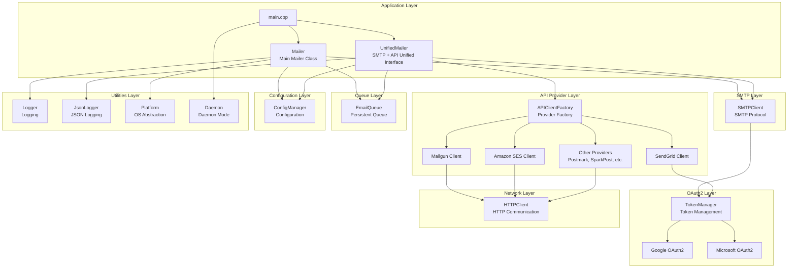
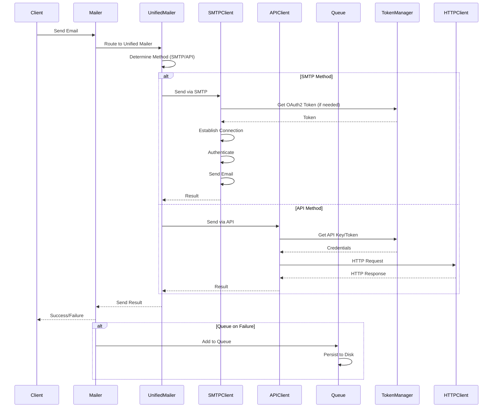
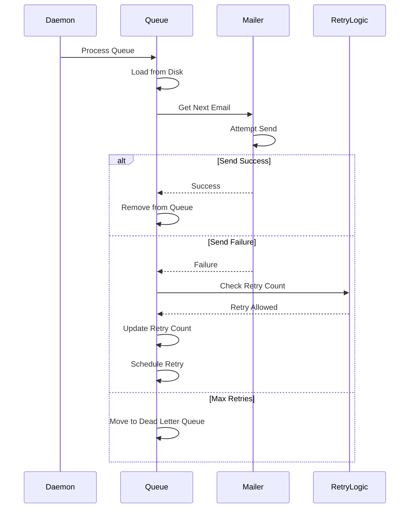

# Simple SMTP Mailer - Architecture Diagrams

## System Architecture

```mermaid
graph TB
    subgraph "Application Layer"
        Main[main.cpp]
        Mailer[Mailer<br/>Main Mailer Class]
        UnifiedMailer[UnifiedMailer<br/>SMTP + API Unified Interface]
    end
    
    subgraph "SMTP Layer"
        SMTPClient[SMTPClient<br/>SMTP Protocol]
    end
    
    subgraph "API Provider Layer"
        APIFactory[APIClientFactory<br/>Provider Factory]
        SendGrid[SendGrid Client]
        Mailgun[Mailgun Client]
        AmazonSES[Amazon SES Client]
        OtherProviders[Other Providers<br/>Postmark, SparkPost, etc.]
    end
    
    subgraph "OAuth2 Layer"
        TokenManager[TokenManager<br/>Token Management]
        GoogleAuth[Google OAuth2]
        MicrosoftAuth[Microsoft OAuth2]
    end
    
    subgraph "Queue Layer"
        EmailQueue[EmailQueue<br/>Persistent Queue]
    end
    
    subgraph "Network Layer"
        HTTPClient[HTTPClient<br/>HTTP Communication]
    end
    
    subgraph "Configuration Layer"
        ConfigManager[ConfigManager<br/>Configuration]
    end
    
    subgraph "Utilities Layer"
        Logger[Logger<br/>Logging]
        JsonLogger[JsonLogger<br/>JSON Logging]
        Platform[Platform<br/>OS Abstraction]
        Daemon[Daemon<br/>Daemon Mode]
    end
    
    Main --> Mailer
    Main --> UnifiedMailer
    Main --> Daemon
    
    Mailer --> SMTPClient
    UnifiedMailer --> SMTPClient
    UnifiedMailer --> APIFactory
    
    APIFactory --> SendGrid
    APIFactory --> Mailgun
    APIFactory --> AmazonSES
    APIFactory --> OtherProviders
    
    SMTPClient --> TokenManager
    SendGrid --> TokenManager
    Mailgun --> HTTPClient
    AmazonSES --> HTTPClient
    OtherProviders --> HTTPClient
    
    TokenManager --> GoogleAuth
    TokenManager --> MicrosoftAuth
    
    Mailer --> EmailQueue
    UnifiedMailer --> EmailQueue
    
    Mailer --> ConfigManager
    UnifiedMailer --> ConfigManager
    
    Mailer --> Logger
    UnifiedMailer --> JsonLogger
    Mailer --> Platform
```

## Email Sending Flow

```mermaid
sequenceDiagram
    participant Client
    participant Mailer
    participant UnifiedMailer
    participant SMTPClient
    participant APIClient
    participant Queue
    participant TokenManager
    
    Client->>Mailer: Send Email
    Mailer->>UnifiedMailer: Route to Unified Mailer
    UnifiedMailer->>UnifiedMailer: Determine Method (SMTP/API)
    
    alt SMTP Method
        UnifiedMailer->>SMTPClient: Send via SMTP
        SMTPClient->>TokenManager: Get OAuth2 Token (if needed)
        TokenManager-->>SMTPClient: Token
        SMTPClient->>SMTPClient: Establish Connection
        SMTPClient->>SMTPClient: Authenticate
        SMTPClient->>SMTPClient: Send Email
        SMTPClient-->>UnifiedMailer: Result
    else API Method
        UnifiedMailer->>APIClient: Send via API
        APIClient->>TokenManager: Get API Key/Token
        TokenManager-->>APIClient: Credentials
        APIClient->>HTTPClient: HTTP Request
        HTTPClient-->>APIClient: HTTP Response
        APIClient-->>UnifiedMailer: Result
    end
    
    UnifiedMailer-->>Mailer: Send Result
    Mailer-->>Client: Success/Failure
    
    alt Queue on Failure
        Mailer->>Queue: Add to Queue
        Queue->>Queue: Persist to Disk
    end
```

## Queue Processing Flow

```mermaid
sequenceDiagram
    participant Daemon
    participant Queue
    participant Mailer
    participant RetryLogic
    
    Daemon->>Queue: Process Queue
    Queue->>Queue: Load from Disk
    Queue->>Mailer: Get Next Email
    Mailer->>Mailer: Attempt Send
    
    alt Send Success
        Mailer-->>Queue: Success
        Queue->>Queue: Remove from Queue
    else Send Failure
        Mailer-->>Queue: Failure
        Queue->>RetryLogic: Check Retry Count
        RetryLogic-->>Queue: Retry Allowed
        Queue->>Queue: Update Retry Count
        Queue->>Queue: Schedule Retry
    else Max Retries
        Queue->>Queue: Move to Dead Letter Queue
    end
```

