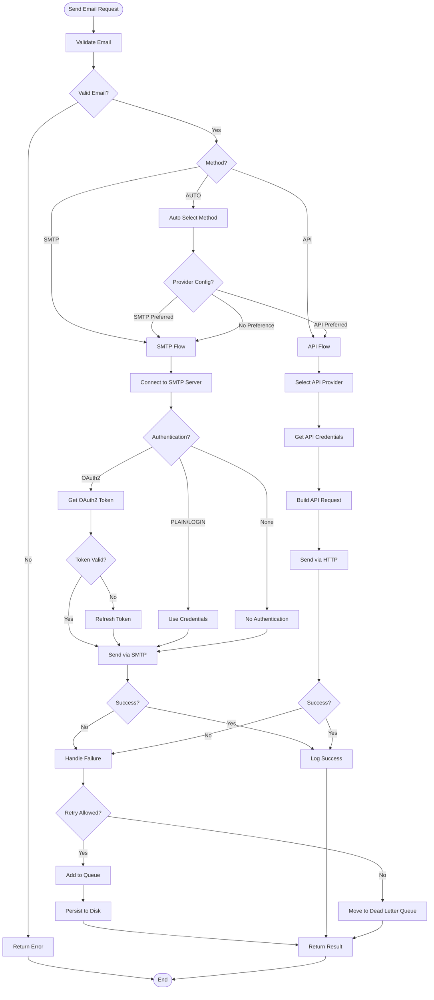
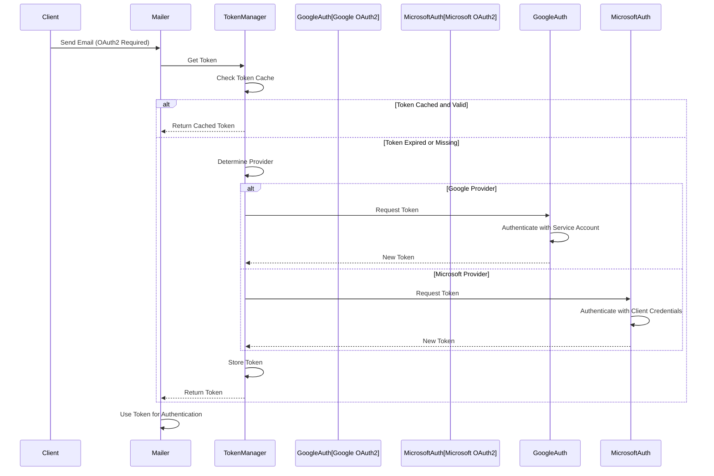
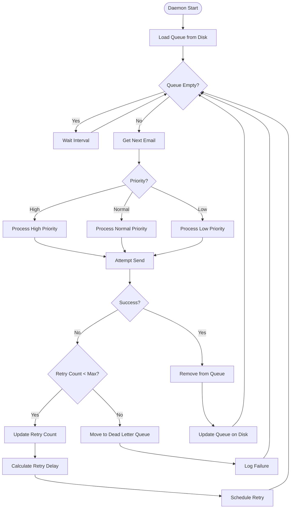
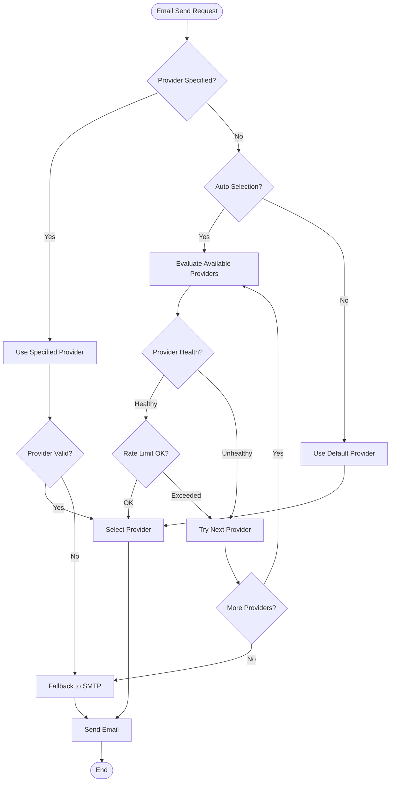

# Simple SMTP Mailer - Flow Diagrams

## Email Sending Flow

```mermaid
flowchart TD
    Start([Send Email Request]) --> Validate[Validate Email]
    Validate --> Valid{Valid Email?}
    Valid -->|No| ReturnError[Return Error]
    Valid -->|Yes| CheckMethod{Method?}
    
    CheckMethod -->|SMTP| SMTPFlow[SMTP Flow]
    CheckMethod -->|API| APIFlow[API Flow]
    CheckMethod -->|AUTO| AutoSelect[Auto Select Method]
    
    AutoSelect --> CheckConfig{Provider Config?}
    CheckConfig -->|SMTP Preferred| SMTPFlow
    CheckConfig -->|API Preferred| APIFlow
    CheckConfig -->|No Preference| SMTPFlow
    
    SMTPFlow --> ConnectSMTP[Connect to SMTP Server]
    ConnectSMTP --> AuthSMTP{Authentication?}
    AuthSMTP -->|OAuth2| GetOAuth2Token[Get OAuth2 Token]
    AuthSMTP -->|PLAIN/LOGIN| UseCredentials[Use Credentials]
    AuthSMTP -->|None| NoAuth[No Authentication]
    
    GetOAuth2Token --> TokenValid{Token Valid?}
    TokenValid -->|No| RefreshToken[Refresh Token]
    TokenValid -->|Yes| SendSMTP[Send via SMTP]
    RefreshToken --> SendSMTP
    UseCredentials --> SendSMTP
    NoAuth --> SendSMTP
    
    APIFlow --> SelectProvider[Select API Provider]
    SelectProvider --> GetAPICreds[Get API Credentials]
    GetAPICreds --> BuildRequest[Build API Request]
    BuildRequest --> SendAPI[Send via HTTP]
    
    SendSMTP --> SMTPResult{Success?}
    SendAPI --> APIResult{Success?}
    
    SMTPResult -->|Yes| LogSuccess[Log Success]
    SMTPResult -->|No| HandleFailure[Handle Failure]
    APIResult -->|Yes| LogSuccess
    APIResult -->|No| HandleFailure
    
    HandleFailure --> CheckRetry{Retry Allowed?}
    CheckRetry -->|Yes| AddToQueue[Add to Queue]
    CheckRetry -->|No| DeadLetter[Move to Dead Letter Queue]
    
    AddToQueue --> PersistQueue[Persist to Disk]
    PersistQueue --> ReturnResult[Return Result]
    LogSuccess --> ReturnResult
    DeadLetter --> ReturnResult
    ReturnError --> End([End])
    ReturnResult --> End
```

## OAuth2 Authentication Flow

```mermaid
sequenceDiagram
    participant Client
    participant Mailer
    participant TokenManager
    participant GoogleAuth[Google OAuth2]
    participant MicrosoftAuth[Microsoft OAuth2]
    
    Client->>Mailer: Send Email (OAuth2 Required)
    Mailer->>TokenManager: Get Token
    TokenManager->>TokenManager: Check Token Cache
    
    alt Token Cached and Valid
        TokenManager-->>Mailer: Return Cached Token
    else Token Expired or Missing
        TokenManager->>TokenManager: Determine Provider
        
        alt Google Provider
            TokenManager->>GoogleAuth: Request Token
            GoogleAuth->>GoogleAuth: Authenticate with Service Account
            GoogleAuth-->>TokenManager: New Token
        else Microsoft Provider
            TokenManager->>MicrosoftAuth: Request Token
            MicrosoftAuth->>MicrosoftAuth: Authenticate with Client Credentials
            MicrosoftAuth-->>TokenManager: New Token
        end
        
        TokenManager->>TokenManager: Store Token
        TokenManager-->>Mailer: Return Token
    end
    
    Mailer->>Mailer: Use Token for Authentication
```

## Queue Processing Flow

```mermaid
flowchart TD
    Start([Daemon Start]) --> LoadQueue[Load Queue from Disk]
    LoadQueue --> QueueEmpty{Queue Empty?}
    QueueEmpty -->|Yes| Wait[Wait Interval]
    QueueEmpty -->|No| GetNext[Get Next Email]
    
    Wait --> QueueEmpty
    
    GetNext --> CheckPriority{Priority?}
    CheckPriority -->|High| ProcessHigh[Process High Priority]
    CheckPriority -->|Normal| ProcessNormal[Process Normal Priority]
    CheckPriority -->|Low| ProcessLow[Process Low Priority]
    
    ProcessHigh --> AttemptSend[Attempt Send]
    ProcessNormal --> AttemptSend
    ProcessLow --> AttemptSend
    
    AttemptSend --> SendResult{Success?}
    SendResult -->|Yes| RemoveFromQueue[Remove from Queue]
    SendResult -->|No| CheckRetryCount{Retry Count < Max?}
    
    CheckRetryCount -->|Yes| UpdateRetryCount[Update Retry Count]
    UpdateRetryCount --> CalculateDelay[Calculate Retry Delay]
    CalculateDelay --> ScheduleRetry[Schedule Retry]
    ScheduleRetry --> QueueEmpty
    
    CheckRetryCount -->|No| MoveToDLQ[Move to Dead Letter Queue]
    MoveToDLQ --> LogFailure[Log Failure]
    LogFailure --> QueueEmpty
    
    RemoveFromQueue --> UpdateQueue[Update Queue on Disk]
    UpdateQueue --> QueueEmpty
```

## API Provider Selection Flow

```mermaid
flowchart TD
    Start([Email Send Request]) --> CheckConfig{Provider Specified?}
    CheckConfig -->|Yes| UseSpecified[Use Specified Provider]
    CheckConfig -->|No| CheckAuto{Auto Selection?}
    
    CheckAuto -->|Yes| EvaluateProviders[Evaluate Available Providers]
    CheckAuto -->|No| UseDefault[Use Default Provider]
    
    EvaluateProviders --> CheckHealth{Provider Health?}
    CheckHealth -->|Healthy| CheckRateLimit{Rate Limit OK?}
    CheckHealth -->|Unhealthy| NextProvider[Try Next Provider]
    
    CheckRateLimit -->|OK| SelectProvider[Select Provider]
    CheckRateLimit -->|Exceeded| NextProvider
    
    NextProvider --> MoreProviders{More Providers?}
    MoreProviders -->|Yes| EvaluateProviders
    MoreProviders -->|No| FallbackSMTP[Fallback to SMTP]
    
    UseSpecified --> ValidateProvider{Provider Valid?}
    ValidateProvider -->|Yes| SelectProvider
    ValidateProvider -->|No| FallbackSMTP
    
    UseDefault --> SelectProvider
    SelectProvider --> SendEmail[Send Email]
    FallbackSMTP --> SendEmail
    SendEmail --> End([End])
```

